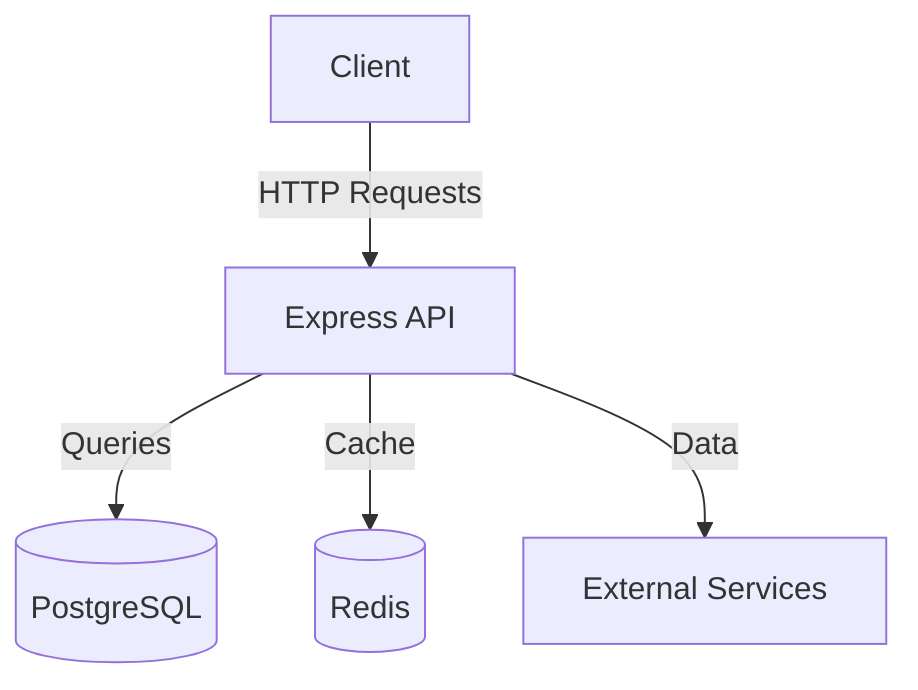

# Agentic Task Runner App

Empowering intelligent market analysis with minimal API dependency.

The Agentic Task Runner App is designed to provide real-time insights into market trends across sports, cryptocurrency, and prediction markets. By employing agentic technology and local models, the app minimizes API usage while delivering timely, accurate reports that predict trends with high potential returns.

## Features

- **Intelligent Task Runners**: Always-on agents analyze data from Kalshi, Polymarket, and crypto APIs.
- **Trend Prediction Reports**: Generate morning, afternoon, and nightly reports for market insights.
- **Local Model Utilization**: Reduces external API calls by processing data locally.
- **User Engagement Metrics**: Tracks report open rates and user satisfaction.

## Tech Stack

- **Frontend**: 
  - React 18.2.0
  - Redux 4.2.0
  - Styled-components 5.3.3

- **Backend**: 
  - Node.js 18.14.0
  - Express 4.18.2
  - Bull 4.0.2
  - Ollama (latest stable)

- **Database**: 
  - PostgreSQL 14
  - Redis 7.0.5

- **Infrastructure**: 
  - Vercel (Frontend Hosting)
  - AWS EC2 (Backend Hosting)
  - AWS RDS (PostgreSQL)
  - GitHub Actions (CI/CD)

## Architecture

The app architecture consists of a React frontend communicating with a Node.js backend API. Data is stored and managed using PostgreSQL, with Redis for caching. External services like Kalshi, Polymarket, and crypto APIs provide data inputs.



## Project Structure

```plaintext
agentic-task-runner-app/
│
├── frontend/
│   ├── public/
│   ├── src/
│   │   ├── components/
│   │   ├── redux/
│   │   ├── styles/
│   │   ├── utils/
│   │   ├── App.js
│   │   ├── index.js
│   │   └── index.css
│   └── package.json
│
├── backend/
│   ├── src/
│   │   ├── controllers/
│   │   ├── models/
│   │   ├── routes/
│   │   ├── services/
│   │   ├── utils/
│   │   ├── app.js
│   │   └── server.js
│   └── package.json
│
├── database/
│   ├── migrations/
│   └── seeds/
│
└── .github/
    └── workflows/
        └── ci-cd.yml
```

## Getting Started

### Prerequisites

- Node.js 18.14.0
- PostgreSQL 14
- Redis 7.0.5
- AWS CLI (for deployment)

### Installation

1. Clone the repository:
   ```bash
   git clone https://github.com/yourusername/agentic-task-runner-app.git
   ```

2. Navigate to the project directory:
   ```bash
   cd agentic-task-runner-app
   ```

3. Install dependencies for both frontend and backend:
   ```bash
   cd frontend && npm install
   cd ../backend && npm install
   ```

### Environment Variables

Set up your environment variables in the `.env.example` files located in both the `frontend` and `backend` directories.

### Running

1. Start the backend server:
   ```bash
   cd backend
   npm start
   ```

2. Start the frontend server:
   ```bash
   cd frontend
   npm start
   ```

## Documentation

For more detailed information, refer to the following documents:

- [Product Requirements](docs/PRD.md)
- [Design Brief](docs/DESIGN.md)
- [Architecture](docs/ARCHITECTURE.md)

## License

This project is licensed under the MIT License.